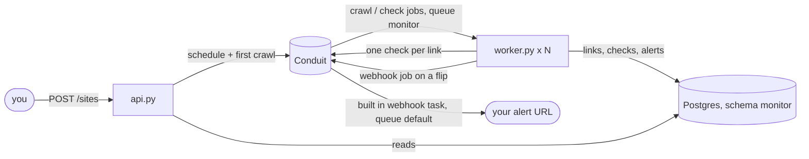

# rotwatch

Watches web pages for broken links and tells you when one breaks or comes back.

> rotwatch runs on [Conduit](https://github.com/JustinK33/Conduit), a job queue on top of Postgres that I also wrote.
> It is a real user of Conduit as much as it is a project of its own, and building it found and fixed bugs in the queue itself.

## What it does

Links rot quietly.
A page you linked to two years ago now 404s, and nobody notices until a reader does.
rotwatch re-crawls the pages you register on a cron, checks every link on them, and keeps the history.

You register a page through a small JSON API.
Each crawl collects the links on the page and fans out one check job per link, spaced out per host so a page with a hundred links does not hit one server a hundred times at once.
The first check of a link only sets a baseline.
After that, a link that flips between working and broken records an alert and sends it to your webhook.

A 404 is recorded as broken straight away, because it will still be a 404 in a minute.
A 5xx, a 429, or a network error is retried up to 3 times first, so one flaky 503 does not page you.

## Tech stack

- Python 3.9+, standard library for the HTTP server, the fetching and the HTML parsing
- [psycopg 3](https://www.psycopg.org/psycopg3/), the only dependency
- PostgreSQL 16, with rotwatch's tables in their own `monitor` schema
- [Conduit](https://github.com/JustinK33/Conduit) v0.5.0 for schedules, job claiming, retries and webhook delivery
- Docker Compose for Postgres and Conduit

## Architecture



`POST /sites` stores the site and creates a Conduit schedule named `site-<id>` that enqueues a `crawl` job on every cron tick.
A worker claims the crawl, fetches the page, and enqueues one `check` per link with the idempotency key `check:<link_id>:<crawl job id>`, so a crawl that is re-run after a crash queues nothing twice.
Another worker claims a check and records the result through `db.record_check`, which locks the link row so a flip is seen exactly once however many workers run.
On a flip it enqueues Conduit's built in `webhook` task, and Conduit POSTs the alert to your URL with its own retries.

## What building this taught me

**Two systems means no shared transaction.**
The first version recorded the alert, committed, then enqueued the webhook.
A review caught that if the enqueue failed, the job retried, saw no flip, and the alert was never sent.
Now an alert keeps a null `webhook_job_id` until its webhook is enqueued, every check sends whatever is still unsent, and the key `alert:<id>` stops a resend from going out twice.

**The same gap shows up on the way in.**
Registering a site writes a row in my database and creates a schedule in Conduit.
If the commit failed after Conduit said yes, the schedule would fire crawls for a site that does not exist, forever.
`create_site` now deletes the schedule again when the transaction fails, and `delete_site` removes the schedule before the row for the same reason.

**Using my own queue from outside found bugs the inside could not.**
Reading Conduit while building this, I found that a job sent without `max_retries` was stored with 0, and the lease reaper treated 0 as no limit, so a job whose worker kept dying was requeued forever.
rotwatch never hit it because it always sets `max_retries`, and Conduit only tested the reaper against fakes, so nothing had caught it.
The fix went into Conduit, along with a race where cancelling a job could overwrite one that had just completed.

## Limits and security

- It checks the links on the page you register and does not crawl recursively.
- It does not honour `Retry-After`.
- The API has no auth.
  It listens on `127.0.0.1` only, rejects requests whose `Host` is not local, and only takes `application/json` POSTs, so a web page open in your browser cannot drive it.
- The worker fetches whatever URL you register, including `localhost` and private addresses.
  That is fine on your own machine, and it is why the API must never be exposed to anyone you do not trust.
- Postgres and Conduit are published on `127.0.0.1` only.
- The compose file sets `CONDUIT_WEBHOOK_ALLOW_PRIVATE_NETWORKS` so alerts can reach a receiver on your machine at `http://host.docker.internal:<port>/`.
  Do not copy that into a real deployment.

## License

MIT.
See [LICENSE](LICENSE).

## Quick start

You need Docker with compose and Python 3.9 or newer.

```
cp .env.example .env    # fill in POSTGRES_PASSWORD and CONDUIT_API_KEY, e.g. openssl rand -hex 32
                        # and put the same password into DATABASE_URL
docker compose up -d    # Postgres on localhost:5432, Conduit on localhost:8080

python3 -m venv .venv
. .venv/bin/activate
pip install -r requirements.txt
set -a; . ./.env; set +a
```

If 5432 or 8080 is taken, set `POSTGRES_PORT` or `CONDUIT_PORT` in `.env` and change `DATABASE_URL` or `CONDUIT_URL` to match.

Start the API and at least one worker, each in its own terminal with `.env` loaded:

```
python api.py       # localhost:8000, set MONITOR_PORT to move it
python worker.py
```

Register a page and look at the results:

```
curl -s -X POST localhost:8000/sites -H 'Content-Type: application/json' \
  -d '{"url": "https://example.com", "alert_url": "https://hooks.example.com/rotwatch", "cron": "*/15 * * * *"}'
curl -s localhost:8000/sites/1               # the site and the current state of each link
curl -s 'localhost:8000/alerts?limit=20'     # newest alerts first
curl -s -X DELETE localhost:8000/sites/1     # stop watching, deletes the schedule and the history
```

Only `url` is required, and `cron` is five fields in UTC that defaults to once an hour.
The page is also crawled right away, so you do not wait for the first tick.

Run the tests with `python -m unittest`, and stop everything with `docker compose down -v`.
